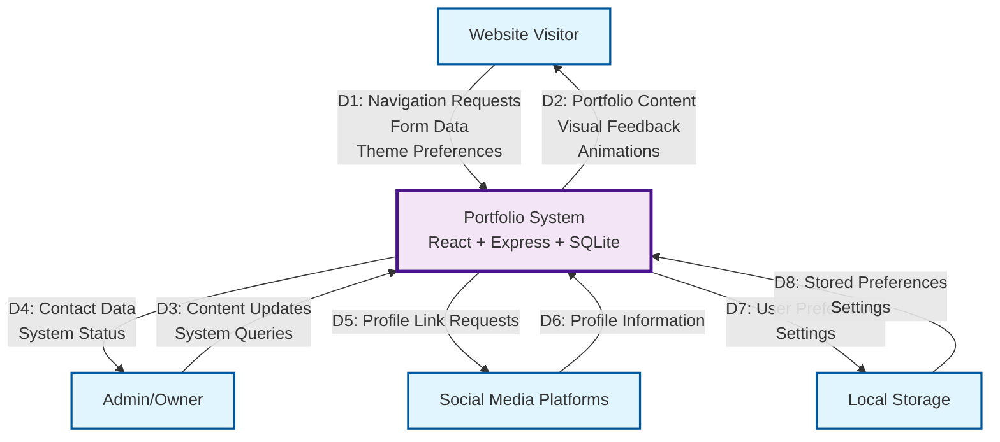
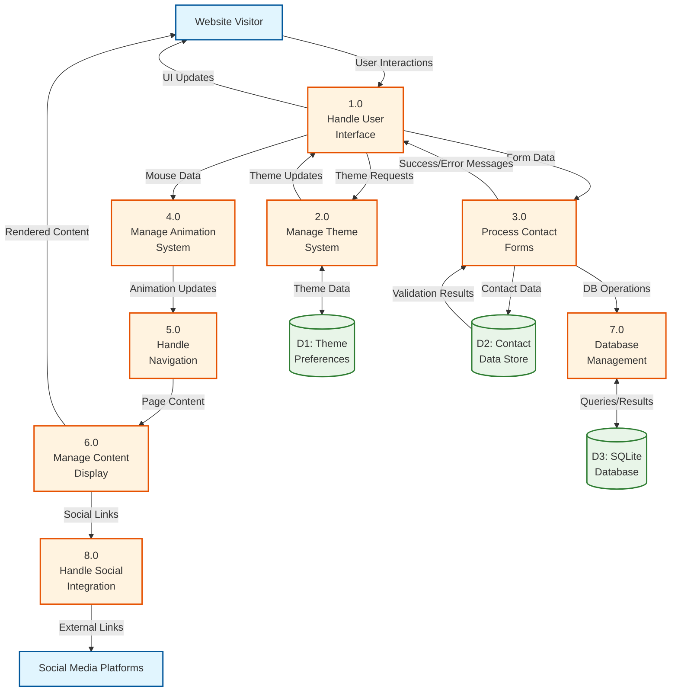
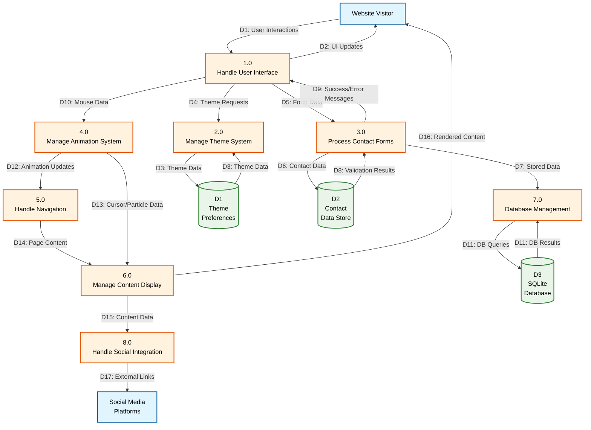
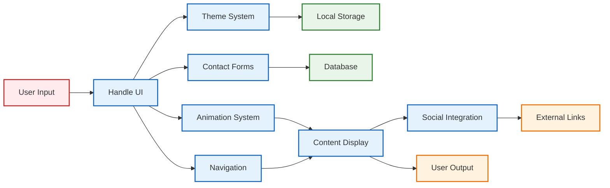
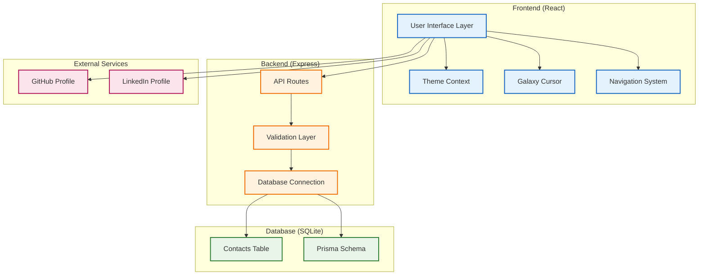

# Portfolio System - DFD Mermaid Diagrams

## 0-Level DFD (Context Diagram)

## 1-Level DFD (System Overview)

## Detailed 1-Level DFD with All Data Flows

## Process Interaction Flow

## System Architecture Overview

